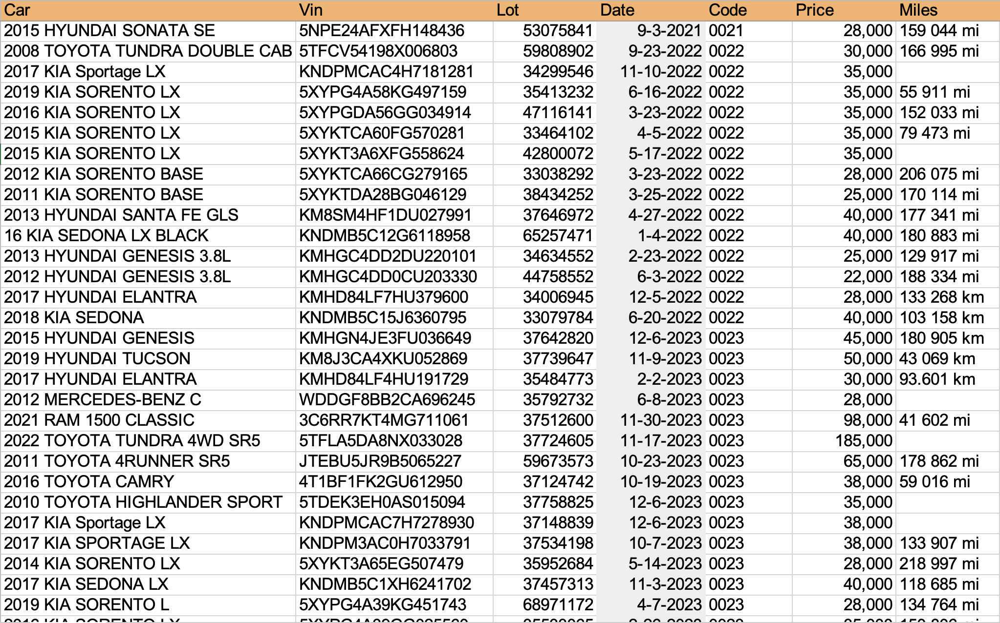

# LabelGenerator

This Python project generates custom labels based on data from an Excel file. The labels include details such as price, lot number, car model, VIN, miles, and a code. Additionally, a custom logo is placed at the bottom-left corner of each label. The generated labels are stored in a time-stamped folder for easy organization.

## Features:
- Automatically generates labels as PNG images.
- Takes data from an Excel sheet (`SourceData.xlsx`).
- Each label includes:
  - Price (formatted with commas).
  - Lot number.
  - Car model.
  - VIN (Vehicle Identification Number).
  - Miles.
  - Code.
  - A logo in the bottom-left corner.
- Saves all labels in a folder with a name based on the current date and time.
  
## Repository Contents:
- **fonts/Roboto**: The font files used for label text formatting.
- **labels_YYYY-MM-DD_HH-MM**: Sample folder containing generated labels.
- **.gitignore**: Specifies files to be ignored by Git (e.g., large files, logs).
- **README.md**: Project documentation (this file).
- **SourceData.xlsx**: Sample Excel file that contains the data used for generating labels.
- **labelGenerator.py**: The Python script that generates the labels.
- **logo.png**: Logo file that is added to each label in the bottom-left corner.

## Technologies Used:

1. **Python 3.x**:
   - **Pandas**: Used to read and manipulate the data from the Excel file (`SourceData.xlsx`).
   - **Pillow (PIL)**: A Python Imaging Library used to create and modify the label images, add text, and place the logo.
   - **Openpyxl**: A Python library used by Pandas to read Excel (`.xlsx`) files.
   
2. **Git & GitHub**:
   - **Version Control**: The code is maintained in a GitHub repository to manage changes and versions.
   
3. **Excel**:
   - **SourceData.xlsx**: The input data file is in Excel format, making it easier to edit and maintain the data.

## How to Run the Project

### Prerequisites:
Ensure you have Python 3.x installed, along with the following libraries:
- `pandas`
- `Pillow` (Python Imaging Library)
- `openpyxl` (to read `.xlsx` files)

You can install the required dependencies with:
```bash
pip install pandas pillow openpyxl
```

### Running the Script:
1. Clone the repository:
```bash
git clone https://github.com/orayda718/LabelGenerator/
cd LabelGenerator
```
2. Prepare the data:
- Edit the `SourceData.xlsx` file with your own data.
- Ensure that the columns in the Excel file match the expected format (Price, Lot, Car, VIN, Miles, Code).
3. Run the Python script:
```bash
python labelGenerator.py
```
4. View the generated labels:
- The generated labels will be saved in a folder named `labels_YYYY-MM-DD_HH-MM` (based on the current date and time) inside the project directory.
- Each label is saved as a `.png` file, named by the VIN number of the corresponding car.

## Sample Files:
- **SourceData.xlsx**: A sample Excel file has been included, which you can modify with your own data.
- **labels_2024-09-26_19-50/**: A folder with sample generated labels is included to showcase the output.

## Screenshots:
### Excel Sheet:
Here's an example of the SourceData.xlsx that contains the data used for generating the labels.

### Sample Generated Label:
Here’s what a sample label looks like, with price, lot number, car, VIN, miles, and code displayed.


## Customization:
- You can modify the fonts by replacing the font files in the `fonts/Roboto` folder.
- Change the logo by replacing the `logo.png` file with your own logo image.
- The script can be adjusted to accommodate different data formats by editing the `labelGenerator.py` script.